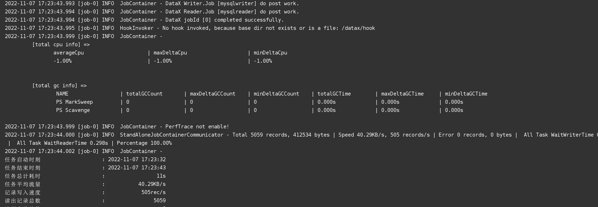
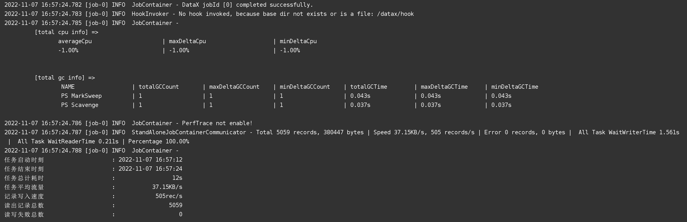
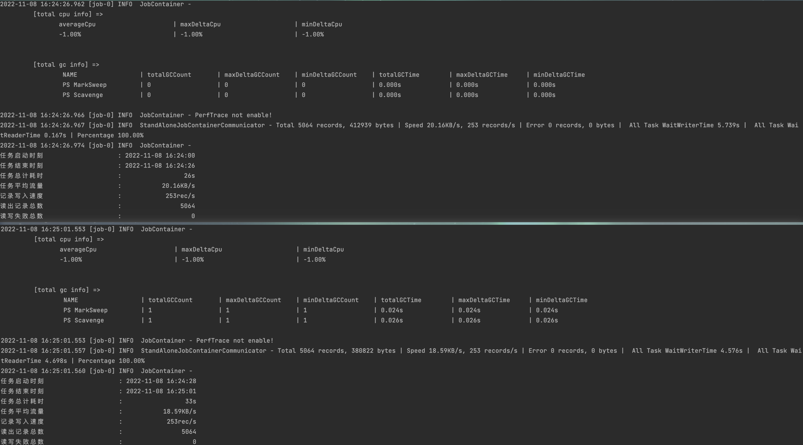
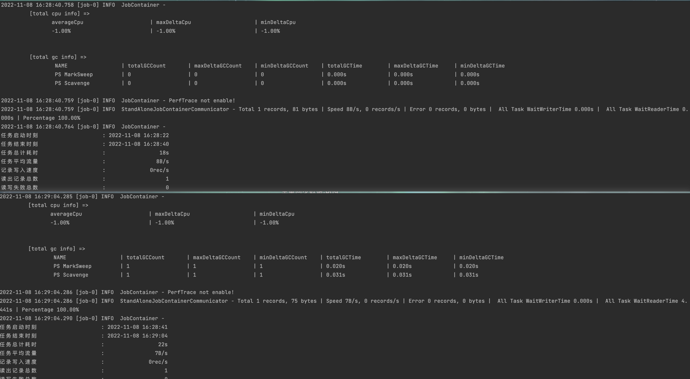

## DataX实用脚本

## 1. 项目简介

一套 [DataX](https://github.com/alibaba/DataX) 数据同步的实用脚本，主要包含mysql2mysql、mysql2es数据同步的配置生成、mysql表结构比对、datax数据同步控制、同步数据的最后时间统计，目录结构如下：

```
.
├── control_script
│   ├── auto_sync_data.sh                // datax数据同步控制脚本
│   └── clear_es_index_data.sh           // 清空es指定索引数据脚本
├── generate_datax_job
│   ├── generate_msyql2es_job.py         // 生成mysql2es的job配置脚本
│   ├── generate_msyql2mysql_job.py      // 生成mysql2mysql的job配置脚本
│   ├── msyql2es_template.json
│   └── msyql2mysql_template.json
├── mysql_diff_schema
│   └── mysql_diff_schema.py             // mysql表结构比对脚本
└── statistical_job_result
    └── statistical_job_result.py        // 统计job的最后更新时间脚本
```

## 2. DataX基本使用示例

### 2.1 全量数据同步

官方的插件文档写的很详细，务必仔细阅读，尤其是参数说明。

- 以MySQL --> MySQL为例，示例包含字段名称映射、字段类型变更、字段内容拆分。MySQL读写参考：[MysqlReader插件文档](https://github.com/alibaba/DataX/blob/master/mysqlreader/doc/mysqlreader.md)、[MysqlWriter插件文档](https://github.com/alibaba/DataX/blob/master/mysqlwriter/doc/mysqlwriter.md)

- 以MySQL --> ElasticSearch为例，示例包含字段名称映射、字段类型变更。ElasticSearch写入参考：[ElasticSearchWriter插件文档](https://github.com/alibaba/DataX/blob/master/elasticsearchwriter/doc/elasticsearchwriter.md)

#### 2.1.1 MySQL至MySQL全量数据同步

demo_mysql2es.json：

```json
{
  "job": {
    "setting": {
      "speed": {
        "channel": 3,
        "byte": 1048576
      },
      "errorLimit": {
        "record": 0,
        "percentage": 0.02
      }
    },
    "content": [
      {
        "reader": {
          "name": "mysqlreader",
          "parameter": {
            "username": "root",
            "password": "your_password",
            "connection": [
              {
                "jdbcUrl": [
                  "jdbc:mysql://ip:3306/source_db?useUnicode=true&characterEncoding=utf8&useSSL=false&serverTimezone=GMT%2B8"
                ],
                "querySql": [
                  "select id,area,city,descs,direction,district,furnish,insert_time,is_deleted,layout,price,size,source,house_type,update_time,SUBSTRING_INDEX(floor, '(', 1) floor_type, replace(SUBSTRING_INDEX(floor, '(', -1),')','') floor_num from spider_second_hand where 1=1"
                ]
              }
            ]
          }
        },
        "writer": {
          "name": "mysqlwriter",
          "parameter": {
            "username": "root",
            "password": "your_password",
            "writeMode": "update",
            "column": [
              "`id`",
              "`area`",
              "`city`",
              "`descs`",
              "`direction`",
              "`district`",
              "`furnish`",
              "`insertTime`",
              "`isDeleted`",
              "`layout`",
              "`price`",
              "`size`",
              "`source`",
              "`houseType`",
              "`updateTime`",
              "`floorType`",
              "`floorNum`"
            ],
            "connection": [
              {
                "table": [
                  "spider_second_hand"
                ],
                "jdbcUrl": "jdbc:mysql://ip:3306/target_db?useUnicode=true&characterEncoding=utf8&useSSL=false&serverTimezone=GMT%2B8"
              }
            ]
          }
        }
      }
    ]
  }
}
```

注意事项：

- 1）jdbcUrl连接信息的?之后必须加上`useUnicode=true&characterEncoding=utf8&useSSL=false&serverTimezone=GMT%2B8`，否则会出现如下错误：

  ```
  Caused by: java.lang.Exception: DataX无法连接对应的数据库，可能原因是：1) 配置的ip/port/database/jdbc错误，无法连接。2) 配置的username/password错误，鉴权失败。请和DBA确认该数据库的连接信息是否正确。
  ```

- 2）where 1=1是为了给下面增量更新Shell脚本使用，会替换这里的`1=1`为实际增量条件，请务必存在`1=1`（中间不要有空格）且整个配置文件仅此处有。

- 3）writeMode为写入模式参数，取值为 insert/replace/update，默认为insert，如果需要更新数据，把这里设置成update，update也可以插入数据。

执行任务：

```
$ python /datax/bin/datax.py /datax/job/demo_mysql2mysql.json
```

执行成功的日志如下：



#### 2.1.2 MySQL至ElasticSearch全量数据同步

demo_mysql2es.json

```json
{
  "job": {
    "setting": {
      "speed": {
        "channel": 1
      }
    },
    "content": [
      {
        "reader": {
          "name": "mysqlreader",
          "parameter": {
            "username": "root",
            "password": "your_password",
            "where":"1=1",
            "column": [
              "`id`",
              "`area`",
              "`city`",
              "`descs`",
              "`direction`",
              "`district`",
              "`furnish`",
              "`insert_time`",
              "`is_deleted`",
              "`layout`",
              "`price`",
              "`size`",
              "`source`",
              "`house_type`",
              "`update_time`"
            ],
            "splitPk": "",
            "connection": [
              {
                "table": [
                  "spider_second_hand"
                ],
                "jdbcUrl": [
                  "jdbc:mysql://ip:3306/target_db?useUnicode=true&characterEncoding=utf8&useSSL=false&serverTimezone=GMT%2B8"
                ]
              }
            ]
          }
        },
        "writer": {
          "name": "elasticsearchwriter",
          "parameter": {
            "endpoint": "http://ip:9200",
            "accessId": "elastic",
            "accessKey": "your_password",
            "index": "spider_second_hand",
            "type": "default",
            "cleanup": false,
            "discovery": false,
            "dynamic": false,
            "batchSize": 1000,
            "splitter": ",",
            "column": [
              {
                "name": "pk",
                "type": "id"
              },
              {
                "name": "area",
                "type": "text"
              },
              {
                "name": "city",
                "type": "text"
              },
              {
                "name": "descs",
                "type": "text"
              },
              {
                "name": "direction",
                "type": "text"
              },
              {
                "name": "district",
                "type": "text"
              },
              {
                "name": "furnish",
                "type": "text"
              },
              {
                "name": "insertTime",
                "type": "date"
              },
              {
                "name": "isDeleted",
                "type": "long"
              },
              {
                "name": "layout",
                "type": "text"
              },
              {
                "name": "price",
                "type": "double"
              },
              {
                "name": "size",
                "type": "double"
              },
              {
                "name": "source",
                "type": "text"
              },
              {
                "name": "houseType",
                "type": "text"
              },
              {
                "name": "updateTime",
                "type": "date"
              }
            ]
          }
        }
      }
    ]
  }
}
```

注意事项：

- 1）jdbcUrl连接信息的?之后必须加上`useUnicode=true&characterEncoding=utf8&useSSL=false&serverTimezone=GMT%2B8`，否则会出现如下错误：

  ```
  Caused by: java.lang.Exception: DataX无法连接对应的数据库，可能原因是：1) 配置的ip/port/database/jdbc错误，无法连接。2) 配置的username/password错误，鉴权失败。请和DBA确认该数据库的连接信息是否正确。
  ```

- 2）where 1=1是为了给下面增量更新Shell脚本使用，会替换这里的`1=1`为实际增量条件，请务必存在`1=1`（中间不要有空格）且整个配置文件仅此处有。

- 3）虽然 datax_v202210 的文档上只写了支持 7.x，但实际测试发现8.x（如8.4.1）也是支持的。

- 4）cleanup设置为false，每次同步时不清空数据，如果设置为true会导致每次同步清空数据，增量同步会受影响。

- 5）使用数据库id作为ES中记录的_id可通过以下方式实现（不需要再指定name为id的字段了，不然会报错）。强烈建议这里使用数据库id，不要用默认的随机id，不然数据更新会出问题。

  ```erlang
  {"name": "pk", "type": "id"},
  ```

  注：如果source表有多个（可能存在id重复问题，会影响到数据更新），这里提供两种解决方案。一种是将多个source先同步到mysql，用mysql的唯一自增主键作为`_id`；另一种是将不同source的id区分开作为`_id`（比如source_table的表名与id进行拼接）。

- 6）如果是向已有的ES索引中同步数据，结构已经有了，需要将dynamic配置为true，不使用DataX中的索引配置。

- 7）DataX目前不支持`dense_vector`向量类型的数据同步，会报如下错误：

  ```json
                    "error": {
                      "type": "mapper_parsing_exception",
                      "reason": "failed to parse",
                      "caused_by": {
                          "type": "parsing_exception",
                          "reason": "Failed to parse object: expecting token of type [VALUE_NUMBER] but found [END_OBJECT]",
                          "line": 1,
                          "col": 838
                       }
                    }
  ```

  DataX仅支持如下类型：

  ```
  ID,PARENT,ROUTING,VERSION,STRING,TEXT,KEYWORD,LONG,INTEGER,SHORT,BYTE,DOUBLE,FLOAT,DATE,BOOLEAN,BINARY,INTEGER_RANGE,
  FLOAT_RANGE,LONG_RANGE,DOUBLE_RANGE,DATE_RANGE,GEO_POINT,GEO_SHAPE,IP,IP_RANGE,COMPLETION,TOKEN_COUNT,OBJECT,NESTED;
  ```

执行任务：

```
$ python /datax/bin/datax.py /datax/job/demo_mysql2es.json
```

执行成功的日志如下：



### 2.2 增量数据同步

对上述的 MySQL --> MySQL、MySQL --> ElasticSearch 进行改进，使其支持基于时间戳的增量数据同步。

#### 2.2.1 增量数据同步的实现思路

DataX 支持多种数据库的读写，JSON 格式配置文件很容易编写，同步性能很好，但是缺乏对增量更新的内置支持。其实增量更新非常简单，只要从目标数据库读取一个最大值的记录，然后根据这个最大值对源数据库要同步的表进行过滤，然后再进行同步即可。

由于 DataX 支持多种数据库的读写，一种相对简单并且可靠的思路就是：

- Step1：利用 DataX 的 DataReader 去目标数据库读取一个最大值；
- Step2：将这个最大值用 TextFileWriter 写入到一个 txt 文件；
- Step3：用 Shell 脚本来读取 txt 文件， 并动态修改全部同步的配置文件；
- Step4：执行修改后的配置文件， 进行增量同步。

注意：使用此方案进行数据同步前，务必保证系统时间正确（可使用date命令查看）。若服务器的系统时间不正确，会使上次同步时间记录出错，最终会导致下次数据同步的条件筛选出错。

#### 2.2.2 增量数据同步的Shell脚本

编写一个自动判断增量同步或全量同步的shell脚本（第一次为全量，后续为增量）

/datax/script/auto_sync_data.sh

```shell
#!/bin/bash

# 错误检查，有错误的时候退出
set -e

# dataX脚本里需要的参数
systemTime=`date +%Y-%m-%d,%H:%M:%S`

# 获取当前时间，这个是同步后要写到txt文件的变量
currentTime=`date +"%Y-%m-%d %H:%M:%S"`
echo ${currentTime}

# datax根路径定义[需要修改]
basePath=/datax
txtPath=${basePath}/job/txt
if [ ! -d "${txtPath}" ];then
    mkdir ${txtPath}
fi
tempPath=${basePath}/job/temp
if [ ! -d "${tempPath}" ];then
    mkdir ${tempPath}
fi

# python命令版本[需要修改]
pythonCmd=python  # python或python3

# json配置文件数组[需要修改]
jsonArray[${#jsonArray[*]}]=demo_mysql2mysql.json
jsonArray[${#jsonArray[*]}]=demo_mysql2es.json
# ...

# 遍历json文件
for i in ${jsonArray[@]}
do
    # 去除.json，拼接获取txt文件名
    echo ${i}
    txtName=${i%.*}.txt
    echo ${txtName}

    # 找到txt文本文件，并将内容读取到一个变量中
    if [ ! -f "${txtPath}" ];then
        touch ${txtPath}/${txtName}
    fi
    MAX_TIME=`cat ${txtPath}/${txtName}`
    echo ${MAX_TIME}

    # 如果最大时间不为""的话，修改全部同步的配置，进行增量更新；如果最大时间为null ,进行全量更新;
    if [ "$MAX_TIME" != "" ]; then
        # 设置增量更新过滤条件
        WHERE="update_time > str_to_date('$MAX_TIME', '%Y-%m-%d %H:%i:%s')"
        # 创建改写后的json临时配置文件（把1=1替换成上面的where条件）
        sed "s/1=1/$WHERE/g" ${basePath}/job/${i} > ${tempPath}/${i/.json/_temp.json}
        # 增量更新
        ${pythonCmd} ${basePath}/bin/datax.py -p "-DsystemTime='$systemTime'" -j "-Xms1g -Xmx1g" ${tempPath}/${i/.json/_temp.json}
    else
        # 全量更新
        ${pythonCmd} ${basePath}/bin/datax.py -p "-DsystemTime='$systemTime'" -j "-Xms1g -Xmx1g"  ${basePath}/job/${i}
    fi

    if [ $? -ne 0 ]; then
      # 执行失败
      echo "datax task execution failed"
    else
      # 执行成功，将最大日期写入txt文件，覆盖写入
      echo  ${currentTime} > ${txtPath}/${txtName}
    fi

# 删除临时文件
rm -rf ${tempPath}/${i/.json/_temp.json}

done
```

先把之前同步过去的全量数据清空，执行增量同步脚本。

```
$ chmod u+x /datax/script/auto_sync_data.sh && /datax/script/auto_sync_data.sh
```

执行结果如下：



然后去source表造一条新数据，重新执行增量同步脚本。

执行结果如下：



另注：使用这个增量数据同步脚本在服务器用Crontab定时任务部署时，有个坑是找不到java、python命令（自己执行脚本时可以找到，但用Crontab定时执行却报错），解决办法是找到java、python解释器路径，将其加到脚本中。

```
$ which python
/usr/bin/python
$ which java
/usr/local/java/jdk1.8.0_351/bin/java
```

在 auto_sync_data.sh 脚本加上解释器路径

```shell
# 配置环境变量，解决crontab执行时找不到python和java环境的问题
PATH+=:/usr/local/bin
PATH+=:/usr/local/java/jdk1.8.0_351/bin
```

定时任务可以这么配置

```
0 */1 * * * cd /root/datax/script && ./auto_sync_data.sh > /root/datax/log/auto_sync_data.log 2>&1 &
```

## 3. 使用模板生成DataX配置文件

### 3.1 需求背景

在大数据领域，尤其是数据仓库领域有许多配置文件，例如ETL作业的配置。大多数的平台都可以通过Web页面或者Restful接口的方式进行ETL作业的配置。

- 痛点：当需要配置大量的ETL作业时，通过Web页面配置效率低，且容易出错。

### 3.2 实现方式

虽然ETL作业的参数很多，但是一般情况下，需要关心往往只有几个，其它使用默认即可。因此可以使用模板，只需要修改模板中我们关心的参数即可。

- 制作模板文件：准备一个ETL作业的配置文件，把需要修改的参数改为 `$变量名`，如`$database`。
- 通过string.Template() 读取模板文件的内容。
- 通过safe_substitute() 给模板文件中的变量赋值。

### 3.3 MySQL2MySQL模板

#### 3.3.1 制作模板

msyql2mysql_template.json

```json
{
  "job": {
    "setting": {
      "speed": {
        "channel": 10,
        "byte": 1048576
      },
      "errorLimit": {
        "record": 0,
        "percentage": 0.02
      }
    },
    "content": [
      {
        "reader": {
          "name": "mysqlreader",
          "parameter": {
            "username": "$reader_username",
            "password": "$reader_password",
            "connection": [
              {
                "jdbcUrl": [
                  "$reader_jdbcUrl"
                ],
                "querySql": [
                  "$reader_querySql"
                ]
              }
            ]
          }
        },
        "writer": {
          "name": "mysqlwriter",
          "parameter": {
            "username": "$writer_username",
            "password": "$writer_password",
            "writeMode": "update",
            "column": $writer_column,
            "connection": [
              {
                "table": [
                  "$writer_table"
                ],
                "jdbcUrl": "$writer_jdbcUrl"
              }
            ]
          }
        }
      }
    ]
  }
}
```

#### 3.3.2 使用模板生成job配置

可以使用如下Python脚本生成MySQL2MySQL的初始Job配置（只需要修改“1. 填写原始配置信息”里的job配置路径和基本连接信息），生成之后根据实际需求进行调整即可。

```
$ pip3 install pymysql
```

generate_msyql2mysql_job.py

```python
# -*- coding: utf-8 -*-

import json
import os
import string
import pymysql


# 查询mysql的所有字段列
def query_mysql_column(mysql_connect, mysql_db, mysql_table):
    cursor = mysql_connect.cursor()
    sql = "SELECT GROUP_CONCAT(COLUMN_NAME SEPARATOR ',') FROM information_schema.COLUMNS WHERE " \
          "TABLE_SCHEMA = '{}' AND TABLE_NAME = '{}'".format(mysql_db, mysql_table)
    cursor.execute(sql)
    result = cursor.fetchall()[0][0]
    cursor.close()
    return result


# 按行追加写入文件（没有文件会新创建文件）
def write_content_to_file(file_path, content):
    a = open(file_path, 'a')
    a.write(content + '\n')
    a.close()
    

if __name__ == '__main__':
    
    ## 1. 填写原始配置信息
    # 1.1 job配置信息
    job_base_path = "/root/datax/job"
    job_name = "generate_msyql2mysql_job_test.json"
    # 1.2 mysql reader配置信息
    reader_mysql_host = '127.0.0.1'
    reader_mysql_user = 'root'
    reader_mysql_password = 'reader_mysql_password'
    reader_mysql_port = 3306
    reader_mysql_db = 'reader_mysql_db'
    reader_mysql_table = 'reader_mysql_table'
    # 1.3 mysql writer配置信息
    writer_mysql_host = '127.0.0.1'
    writer_mysql_user = 'root'
    writer_mysql_password = 'writer_mysql_password'
    writer_mysql_port = 3306
    writer_mysql_db = 'writer_mysql_db'
    writer_mysql_table = 'writer_mysql_table'
    
    ## 2. 将原始配置信息构造二级配置信息
    job_file_path = job_base_path + "/" + job_name
    reader_jdbcUrl = "jdbc:mysql://{}:{}/{}?useUnicode=true&characterEncoding=utf8&useSSL=false&serverTimezone=GMT%2B8"\
        .format(reader_mysql_host, reader_mysql_port, reader_mysql_db)
    writer_jdbcUrl = "jdbc:mysql://{}:{}/{}?useUnicode=true&characterEncoding=utf8&useSSL=false&serverTimezone=GMT%2B8"\
        .format(writer_mysql_host, writer_mysql_port, writer_mysql_db)

    ## 3. 查询字段信息并处理
    # 3.1 查询reader中的MySQL字段信息并拼接
    # 获取逗号分割的字段字符串
    reader_mysql_connect = pymysql.connect(host=reader_mysql_host, user=reader_mysql_user,
                                           password=reader_mysql_password, port=reader_mysql_port,
                                           db=reader_mysql_db, charset='utf8')
    reader_mysql_column = query_mysql_column(reader_mysql_connect, reader_mysql_db, reader_mysql_table)
    reader_mysql_connect.close()
    # 拼接querySql
    reader_querySql = "select {} from {} where 1=1".format(reader_mysql_column, reader_mysql_table)
    # 3.2 查询writer中的MySQL字段列表
    # 获取逗号分割的字段字符串
    writer_mysql_connect = pymysql.connect(host=writer_mysql_host, user=writer_mysql_user,
                                           password=writer_mysql_password, port=writer_mysql_port,
                                           db=writer_mysql_db, charset='utf8')
    writer_mysql_column = query_mysql_column(writer_mysql_connect, writer_mysql_db, writer_mysql_table)
    writer_mysql_connect.close()
    writer_mysql_column_list = writer_mysql_column.split(",")
    result = []
    for writer_mysql_column_item in writer_mysql_column_list:
        result.append("`{}`".format(writer_mysql_column_item))
    # 格式化输出json
    writer_column = json.dumps(result, sort_keys=True, indent=2)

    ## 4. 使用模板生成job配置
    # 替换模板中的变量
    file = open('msyql2mysql_template.json', encoding='utf-8')
    content = file.read()
    template_setting = string.Template(content)
    job_config = template_setting.safe_substitute(reader_username=reader_mysql_user, reader_password=reader_mysql_password,
                                                  reader_jdbcUrl=reader_jdbcUrl, reader_querySql=reader_querySql,
                                                  writer_username=writer_mysql_user, writer_password=writer_mysql_password,
                                                  writer_jdbcUrl=writer_jdbcUrl, writer_table=writer_mysql_table,
                                                  writer_column=writer_column)
    # 输出结果到文件
    print(job_config)
    if os.path.exists(job_file_path):
        os.remove(job_file_path)
    write_content_to_file(job_file_path, job_config)
```

### 3.4 MySQL2ElasticSearch模板

#### 3.4.1 制作模板

msyql2es_template.json

```json
{
  "job": {
    "setting": {
      "speed": {
        "channel": 1
      }
    },
    "content": [
      {
        "reader": {
          "name": "mysqlreader",
          "parameter": {
            "username": "$reader_username",
            "password": "$reader_password",
            "connection": [
              {
                "jdbcUrl": [
                  "$reader_jdbcUrl"
                ],
                "querySql": [
                  "$reader_querySql"
                ]
              }
            ]
          }
        },
        "writer": {
          "name": "elasticsearchwriter",
          "parameter": {
            "endpoint": "$writer_endpoint",
            "accessId": "$writer_accessId",
            "accessKey": "$writer_accessKey",
            "index": "$writer_index",
            "type": "default",
            "cleanup": false,
            "discovery": false,
            "dynamic": true,
            "batchSize": 1000,
            "splitter": ",",
            "column": $writer_column
          }
        }
      }
    ]
  }
}
```

#### 3.4.2 使用模板生成job配置

可以使用如下Python脚本生成MySQL2ElasticSearch的初始Job配置（只需要修改“1. 填写原始配置信息”里的job配置路径和基本连接信息），生成之后根据实际需求进行调整即可。

```
$ pip3 install pymysql
$ pip3 install elasticsearch==7.16.2
```

generate_msyql2es_job.py

```python
# -*- coding: utf-8 -*-

import json
import os
import string
import pymysql
from elasticsearch import Elasticsearch


# 获取单个ES索引的详细信息
def get_index_info(es_connect, writer_es_index):
    return es_connect.indices.get_mapping(index=writer_es_index)


# 查询mysql的所有字段列
def query_mysql_column(mysql_connect, reader_mysql_db, reader_mysql_table):
    cursor = mysql_connect.cursor()
    sql = "SELECT GROUP_CONCAT(COLUMN_NAME SEPARATOR ',') FROM information_schema.COLUMNS WHERE " \
          "TABLE_SCHEMA = '{}' AND TABLE_NAME = '{}'".format(reader_mysql_db, reader_mysql_table)
    cursor.execute(sql)
    result = cursor.fetchall()[0][0]
    cursor.close()
    return result


# 按行追加写入文件（没有文件会新创建文件）
def write_content_to_file(file_path, content):
    a = open(file_path, 'a')
    a.write(content + '\n')
    a.close()


if __name__ == '__main__':

    ## 1. 填写原始配置信息
    # 1.1 job配置信息
    job_base_path = "/root/datax/job"
    job_name = "generate_msyql2es_job_test.json"
    # 1.2 mysql reader配置信息
    reader_mysql_host = '127.0.0.1'
    reader_mysql_user = 'root'
    reader_mysql_password = 'mysql_password'
    reader_mysql_port = 3306
    reader_mysql_db = 'mysql_db'
    reader_mysql_table = 'mysql_table'
    # 1.3 es writer配置信息
    writer_es_endpoint = "http://ip:port"
    writer_es_accessId = "elastic"
    writer_es_accessKey = "es_password"
    writer_es_index = "es_index"

    ## 2. 将原始配置信息构造二级配置信息
    job_file_path = job_base_path + "/" + job_name
    reader_jdbcUrl = "jdbc:mysql://{}:{}/{}?useUnicode=true&characterEncoding=utf8&useSSL=false&serverTimezone=GMT%2B8"\
        .format(reader_mysql_host, reader_mysql_port, reader_mysql_db)

    ## 3. 查询字段信息并处理
    # 3.1 查询MySQL字段信息并拼接
    # 获取逗号分割的字段字符串
    mysql_connect = pymysql.connect(host=reader_mysql_host, user=reader_mysql_user,
                                    password=reader_mysql_password, port=reader_mysql_port,
                                    db=reader_mysql_db, charset='utf8')
    reader_mysql_column = query_mysql_column(mysql_connect, reader_mysql_db, reader_mysql_table)
    mysql_connect.close()

    # 拼接querySql
    reader_querySql = "select {} from {} where 1=1".format(reader_mysql_column, reader_mysql_table)
    # 3.2 查询ES字段信息并处理
    # 获取单个索引的信息
    es_connect = Elasticsearch(
        hosts=[writer_es_endpoint],
        http_auth=(writer_es_accessId, writer_es_accessKey),
        timeout=60
    )
    index_info = get_index_info(es_connect, writer_es_index)
    index_mappings_info = index_info[writer_es_index]['mappings']['properties']
    # 遍历字典，过滤key中包含@的（@timestamp、@version），按照datax的column重新生成格式
    result = []
    default_dict_item = {"name": "pk", "type": "id"}
    result.append(default_dict_item)
    for key, value in index_mappings_info.items():
        dict_item = {}
        if "@" not in key:
            dict_item['name'] = key
            dict_item['type'] = value['type']
            result.append(dict_item)
    # 格式化输出json
    writer_column = json.dumps(result, sort_keys=True, indent=2)

    ## 4. 使用模板生成job配置
    # 替换模板中的变量
    file = open('msyql2es_template.json', encoding='utf-8')
    content = file.read()
    template_setting = string.Template(content)
    job_config = template_setting.safe_substitute(reader_username=reader_mysql_user, reader_password=reader_mysql_password,
                                                  reader_jdbcUrl=reader_jdbcUrl, reader_querySql=reader_querySql,
                                                  writer_endpoint=writer_es_endpoint, writer_accessId=writer_es_accessId,
                                                  writer_accessKey=writer_es_accessKey, writer_index=writer_es_index,
                                                  writer_column=writer_column)
    # 输出结果到文件
    print(job_config)
    if os.path.exists(job_file_path):
        os.remove(job_file_path)
    write_content_to_file(job_file_path, job_config)

    ## 5. 附加：生成清空该ES索引的脚本
    clear_es_index_script_path = './clear_index_data.sh'
    content_template = string.Template("curl -u ${writer_es_accessId}:${writer_es_accessKey} -XPOST '${writer_es_endpoint}/${writer_es_index}/_delete_by_query?refresh&slices=5&pretty' -H 'Content-Type: application/json' -d'{\"query\": {\"match_all\": {}}}'")
    script_content = content_template.safe_substitute(writer_es_accessId=writer_es_accessId, writer_es_accessKey=writer_es_accessKey, writer_es_endpoint=writer_es_endpoint, writer_es_index=writer_es_index)
    write_content_to_file(clear_es_index_script_path, script_content)
```

另注：该脚本还会在当前路径自动生成一个clear_index_data.sh脚本，它可以利用curl命令清空当前索引的数据（保留索引结构），需要重新同步数据时会用得到。

## 4. 统计job的最后更新时间

由于之前每个增量数据同步任务的job都是由单独的txt来记录的，查看不够方便。这里写了个Python脚本，定时统计每个任务的最后更新时间，写到一个csv文件里。如果存在任务长时间未更新，就有可能是出现问题了，请及时排查。

```
$ pip3 install schedule
```

statistical_job_result.py

```python
# -*- coding: utf-8 -*-

import os
import csv
import time
import schedule


# 读取指定目录下的所有文件夹保存成列表
def read_dir_to_list(file_dir_path):
    file_dir_list = os.listdir(file_dir_path)
    return file_dir_list


# 按行读取txt文件的内容，保存成列表
def read_txt_to_list(txt_path):
    result = []
    with open(txt_path, 'r') as f:
        for line in f:
            result.append(line.strip('\n'))
    return result


# 创建csv并写入字典
def create_csv(fieldnames, path, dict):
    with open(path, 'w', newline='') as f:
        writer = csv.DictWriter(f, fieldnames=fieldnames)
        writer.writeheader()
        writer.writerow(dict)


# 将字典追加写入csv
def append_csv(fieldnames, path, dict):
    with open(path, 'a', newline='') as f:
        writer = csv.DictWriter(f, fieldnames=fieldnames)
        writer.writerow(dict)


# 统计任务最后执行时间写入CSV文件
def statistical_job_result(job_txt_path, job_result_path):

    statistical_time = time.strftime("%Y-%m-%d %H:%M:%S", time.localtime())
    job_txt_file_list = read_dir_to_list(job_txt_path)
    fieldnames = []
    fieldnames.append('statistical_time')
    csv_data = {}
    csv_data['statistical_time'] = statistical_time
    for job_txt_file in job_txt_file_list:
        file_name, file_ext = os.path.splitext(job_txt_file)      # 截取文件名作为csv的列名
        job_last_update = read_txt_to_list(job_txt_path + "/" + job_txt_file)[0]       # 读取job的最后更新时间
        csv_data[file_name] = job_last_update
        fieldnames.append(file_name)

    if not os.path.exists(job_result_path):
        create_csv(fieldnames, job_result_path, csv_data)
    else:
        append_csv(fieldnames, job_result_path, csv_data)


if __name__ == '__main__':

    job_txt_path = '../job/txt'
    job_result_path = './job_result.csv'

    # 配置定时任务，可同时启动多个
    # schedule.every(30).minutes.do(statistical_job_result(job_txt_path, job_result_path))         # 每隔30分钟运行一次job
    schedule.every().hour.do(statistical_job_result(job_txt_path, job_result_path))                # 每隔1小时运行一次job
    # schedule.every().day.at("23:59").do(statistical_job_result(job_txt_path, job_result_path))   # 每天在23:59时间点运行job
    # schedule.every().monday.do(statistical_job_result(job_txt_path, job_result_path))            # 每周一运行一次job

    statistical_job_result(job_txt_path, job_result_path)  # 启动时立即执行一次，随后进入定时任务
    while True:
        schedule.run_pending()
        time.sleep(1)
```

注：如果不想用Python的schedule库实现定时任务，而是用系统的Crontab来实现，注释掉相关代码即可。需要注意的是，配置crontab的时候，python3命令要写上完整路径，不然会找不到python3命令。

```
0 */1 * * * cd /datax/script/ && /usr/local/bin/python3 statistical_job_result.py
```

## 5. 数据库表结构差异比对

MySQL 数据库表结构对比工具

- 环境依赖：Python3.9（别的版本可能也行，但我没试），依赖安装`pip3 install mysql-connector`

使用方式：支持“使用SQL文件对比”、“连接数据库对比”两种使用方式。

- 使用SQL文件对比：`python3 mysql_diff_schema.py -d file -s source.sql -t target.sql -o diff.sql`
- 连接数据库对比：`python3 mysql_diff_schema.py -d db -s root:root@127.0.0.1:3306~dbname1 -t root:root@127.0.0.1:3306~dbname2 -o diff.sql`

使用效果：会生成一个 `diff.sql` 文件，里面会生成同步表结构差异的修改语句，执行它即可同步表结构差异。

注意事项：

- 表设置信息修改只检查 `ENGINE`, `CHARSET`, `COMMENT`的改变来做对比。
- 使用 SQL 文件对比请确保源文件和目标文件都是使用相同一个工具导出。

mysql_diff_schema.py

```python
# -*- coding: utf-8 -*-

import re
import mysql.connector
from optparse import OptionParser


def config_option():
    usage = "%prog [options] arg \n"
    usage += " Demo1: %prog -d file -s source_schema.sql -t target_schema.sql -o diff_schema.sql\n Demo2: %prog -d db -s root:root@127.0.0.1:3306~dbname1 -t root:root@127.0.0.1:3306~dbname2 -o diff.sql"
    parser = OptionParser(usage)
    parser.add_option("-d", "--data", dest="data", help="data sources can be a file or db")
    parser.add_option("-s", "--source", dest="source_schema", help="source database schema can be a sql file or a database")
    parser.add_option("-t", "--target", dest="target_schema", help="target database schema can be a sql file or a database")
    parser.add_option("-o", "--output", dest="diff_alters", help="output diff alters to sql file")
    (options, args) = parser.parse_args()

    if not options.data or not options.target_schema or not options.source_schema or not options.diff_alters:
        parser.error("必须输入参数：-d -t -s -o");
    if options.data and options.data not in ['file', 'db']:
        parser.error('Incorrect data source type.')

    global opt_main
    opt_main = {}
    opt_main["data_source"] = options.data
    opt_main["target_schema"] = options.target_schema
    opt_main["source_schema"] = options.source_schema
    opt_main["diff_alters"] = options.diff_alters


class SchemaObjects(object):
    def __init__(self, target_schema, source_schema):
        self.target_schema = target_schema
        self.source_schema = source_schema
        self.run()

    def run(self):
        self.objects_alters = ''
        self.return_objects = {}
        self.return_objects['tables'] = {}
        self.return_objects['servers'] = {}
        self.return_objects['events'] = {}
        self.return_objects['routines'] = {}
        self.return_objects['triggers'] = {}

        if opt_main['data_source'] == 'db':
            self.source_tables = self._get_database_tables(self.source_schema)
            self.target_tables = self._get_database_tables(self.target_schema)
        else:
            self.source_tables = self._get_sql_tables(self.source_schema)
            self.target_tables = self._get_sql_tables(self.target_schema)

        self.diff_tables = self._get_diff_tables(self.target_tables, self.source_tables)
        for table in self.diff_tables:
            self.return_objects['tables'][table] = {}
            self.return_objects['tables'][table]['target_table'] = self._get_table_definitions(
                self.diff_tables[table]['target_table'])
            self.return_objects['tables'][table]['source_table'] = self._get_table_definitions(
                self.diff_tables[table]['source_table'])

    def _record_alters(self, alter):
        self.objects_alters += alter
        self.objects_alters += "\n"
        print(alter)

    def get_objects_alters(self):
        return self.objects_alters

    def get_schema_objects(self):
        return self.return_objects

    def _get_servers(self, schema_name):
        pass

    def _get_events(self, schema_name):
        pass

    def _get_routines(self, schema_name):
        pass

    def _get_triggers(self, schema_name):
        pass

    def _get_sql_tables(self, schema_name):
        """
        @brief      Gets the sql tables.
        
        @param      self         The object
        @param      schema_name  The schema name
        
        @return     The sql tables.
        """
        try:
            schema_file = open(schema_name, 'r')
        except IOError:
            print('Cannot open file', schema_name)
        else:
            schema_file.readline()
            schema_string = ''
            for line in schema_file:
                schema_string = schema_string + line
            schema_file.close()
            return_tables = {}
            tables = re.findall(r"CREATE\s*TABLE[^;]*;", schema_string)
            for table in tables:
                table_name = re.match(r"(CREATE\s*TABLE\s*\`)(.*)(\`\s*\()", table)
                if table_name:
                    return_tables[table_name.group(2)] = table

            return return_tables

    def _get_database_tables(self, conn_config):
        """
        @brief      Gets the database tables.
        
        @param      self         The object
        @param      conn_config  The connection configuration
        
        @return     The database tables.
        """
        config = re.match(r"([^:]*):(.*)@(.*)~([^~]*)", conn_config)  # format -> root:root@127.0.0.1:3306~db1
        if not config:
            raise Exception('parameter errors: %s' % (conn_config))
        db_info = {}
        if config.group(1):
            db_info['user'] = config.group(1)
        else:
            raise Exception('parameter errors: %s' % (conn_config))
        if config.group(2):
            db_info['pass'] = config.group(2)
        else:
            db_info['pass'] = ''
        host_info = config.group(3)
        host_re = re.match(r"([^:]*)(.*)", host_info)
        host = host_re.group(1)
        port = host_re.group(2).strip(':')
        db_info['host'] = host
        if port:
            db_info['port'] = port
        else:
            db_info['port'] = 3306
        if config.group(4):
            db_info['db'] = config.group(4)
        else:
            raise Exception('parameter errors: %s' % (conn_config))

        conn = mysql.connector.connect(
            host=db_info['host'],
            user=db_info['user'],
            password=db_info['pass'],
            database=db_info['db'],
            port=db_info['port'],
            charset='utf8'
        )
        cmd = conn.cursor()
        cmd.execute("show tables")
        tables = cmd.fetchall()
        table_schema = {}
        for table_name in tables:
            cmd.execute("show create table `%s`;" % (table_name))
            show_create = cmd.fetchone()
            table_schema[show_create[0]] = show_create[1]

        return table_schema

    def _get_diff_tables(self, target_tables, source_tables):
        return_tables = {}
        if target_tables and source_tables:
            for table in target_tables:
                if table in source_tables:
                    if target_tables[table] == source_tables[table]:
                        pass
                    else:
                        return_tables[table] = {}
                        return_tables[table]['target_table'] = target_tables[table]
                        return_tables[table]['source_table'] = source_tables[table]
                else:
                    self._record_alters("-- %s" % (table))
                    self._record_alters("DROP TABLE `%s`;" % (table))
                    self._record_alters(" ")

            for table in source_tables:
                if table in target_tables:
                    pass
                else:
                    self._record_alters("-- %s" % (table))
                    self._record_alters("%s;" % (source_tables[table].strip(';')))
                    self._record_alters(" ")

        return return_tables

    def _get_table_definitions(self, schema_table):
        return_definitions = {}
        return_definitions['column'] = {}
        return_definitions['primary'] = {}
        return_definitions['unique'] = {}
        return_definitions['key'] = {}
        return_definitions['foreign'] = {}
        return_definitions['fulltext'] = {}
        return_definitions['option'] = {}
        return_definitions['column_position'] = {}

        table_definitions = schema_table.split('\n')

        for definition in table_definitions:
            column_name = re.match(r"(\s*\`)([^`]*)(\`.*)", definition)
            if column_name:
                tmp = column_name.group().split(",")
                _column_content = ",".join(tmp[:-1])
                return_definitions['column'][column_name.group(2)] = _column_content.strip()
                return_definitions['column_position'][column_name.group(2)] = table_definitions.index(definition)

            primary_name = re.match(r"(\s*PRIMARY KEY\s*)", definition)
            if primary_name:
                return_definitions['primary']['primary'] = re.match(r"(\s*)(PRIMARY KEY \(.*\))(,?)", definition).group(2)

            unique_name = re.match(r"(\s*UNIQUE KEY \`)([^`]*)(\`.*)", definition)
            if unique_name:
                return_definitions['unique'][unique_name.group(2)] = re.match(r"(\s*)(UNIQUE KEY.*\))(,?)", definition).group(2)

            key_name = re.match(r"(\s*KEY \`)([^`]*)(\`.*)", definition)
            if key_name:
                return_definitions['key'][key_name.group(2)] = re.match(r"(\s*)(KEY.*\))(,?)", definition).group(2)

            foreign_name = re.match(r"(\s*CONSTRAINT \`)([^`]*)(\`.*)", definition)
            if foreign_name:
                return_definitions['foreign'][foreign_name.group(2)] = re.match(r"(\s*)(CONSTRAINT[^,]*)(,?)", definition).group(2)

            fulltext_name = re.match(r"(\s*FULLTEXT KEY \`)([^`]*)(\`.*)", definition)
            if fulltext_name:
                return_definitions['fulltext'][fulltext_name.group(2)] = re.match(r"(\s*)(FULLTEXT KEY.*\))(,?)", definition).group(2)

            option_name = re.match(r"(\)\s*ENGINE=.*)", definition)
            if option_name:
                pattern = re.compile(r' AUTO_INCREMENT=\d+| ROW_FORMAT=\w+', re.I)
                engine_content = re.sub(pattern, '', re.match(r"(\)\s*)(ENGINE[^\n]*)(;?)", definition).group(2))
                return_definitions['option']['option'] = engine_content

        return return_definitions


class SchemaAlters(object):
    def __init__(self, schema_objects):
        self.diff_objects = schema_objects
        self.run()

    def run(self):
        self.definitions_alters = ''
        self.return_alters = {}
        self.return_alters['tables'] = {}
        self.return_alters['servers'] = {}
        self.return_alters['events'] = {}
        self.return_alters['routines'] = {}
        self.return_alters['triggers'] = {}
        self._alter_tables(self.diff_objects['tables'])

    def _record_alters(self, alter):
        self.definitions_alters += alter
        self.definitions_alters += "\n"
        print(alter)

    def get_definitions_alters(self):
        return self.definitions_alters

    def _alter_tables(self, schema_tables):
        for table in schema_tables:
            target_table = schema_tables[table]['target_table']
            source_table = schema_tables[table]['source_table']

            _alter = ''
            _alter += self._column(table, target_table['column'], source_table['column'])
            _alter += self._primary(table, target_table['primary'], source_table['primary'])
            _alter += self._unique(table, target_table['unique'], source_table['unique'])
            _alter += self._key(table, target_table['key'], source_table['key'])
            _alter += self._foreign(table, target_table['foreign'], source_table['foreign'])
            _alter += self._fulltext(table, target_table['fulltext'], source_table['fulltext'])
            _alter += self._option(table, target_table['option'], source_table['option'])
            if _alter:
                self._record_alters("-- %s" % (table))
                self._record_alters("%s \n" % (_alter.strip('\n')))

    def _get_option_diff(self, source_option, target_option):
        """
        @brief      获取表设置差异
        
        @param      self           The object
        @param      source_option  The source option
        @param      target_option  The target option
        
        @return     The option difference.
        """
        check_option = ['ENGINE', 'CHARSET', 'COMMENT']  # 指定检查表设置项
        sources = source_option.strip(';').split(' ')
        targets = target_option.strip(';').split(' ')

        pattern = re.compile(r"COMMENT=(.*)")
        find_comment = pattern.findall(source_option)
        if find_comment:
            _comment = find_comment[0].strip(';')
        else:
            _comment = '\'\''

        _sources = {}
        _targets = {}
        for target_item in targets:
            if target_item:
                _item = target_item.split('=', 1)
                if len(_item) == 2 and _item[0] in check_option:
                    _targets[_item[0]] = _item[1]

        for source_item in sources:
            if source_item:
                _item = source_item.split('=', 1)
                if len(_item) == 2 and _item[0] in check_option:
                    _sources[_item[0]] = _item[1]

        option_diff = ''
        for option_member in check_option:
            if option_member in _sources.keys() and option_member in _targets.keys() and _sources[option_member] == \
                    _targets[option_member]:
                pass
            else:
                if option_member == 'COMMENT':
                    option_diff += option_member + '=' + _comment
                else:
                    if option_member not in _sources.keys() and option_member in _targets.keys():
                        option_diff += option_member + '=\'\''
                    else:
                        option_diff += option_member + '=' + _sources[option_member] + ' '

        return option_diff.strip()

    def _get_column_position_num(self, column_position, column):
        """
        @brief      获取字段所在位置（数字）
        
        @param      self             The object
        @param      column_position  The column position
        @param      column           The column
        
        @return     The column position number.
        """
        if (column_position[column]):
            return column_position[column]
        return 0

    def _get_next_column(self, position_dict, column):
        """
        @brief      获取下一个字段
        
        @param      self           The object
        @param      position_dict  The position dictionary
        @param      column         The column
        
        @return     The next column.
        """
        if position_dict[column] == len(position_dict):
            # 最后一个字段没有下一个字段，返回空
            return ''
        next_position = position_dict[column] + 1
        next_column = list(position_dict.keys())[list(position_dict.values()).index(next_position)]
        return next_column

    def _get_before_column(self, position_dict, column):
        """
        @brief      获取上一个字段
        
        @param      self           The object
        @param      position_dict  The position dictionary
        @param      column         The column
        
        @return     The before column.
        """
        if position_dict[column] == 1:
            # 第1个字段前面没有字段
            return ''
        before_position = position_dict[column] - 1
        before_column = list(position_dict.keys())[list(position_dict.values()).index(before_position)]
        return before_column

    def _get_target_next_column(self, source_position_dict, target_position_dict, column):
        """
        @brief      获取目标结构中的下一个字段
        
        @param      self                  The object
        @param      source_position_dict  The source position dictionary
        @param      target_position_dict  The target position dictionary
        @param      column                The column
        
        @return     The target next column.
        """
        source_position = source_position_dict[column]
        if source_position < len(source_position_dict):
            for x in range(source_position + 1, len(source_position_dict) + 1):
                next_column = list(source_position_dict.keys())[list(source_position_dict.values()).index(x)]
                if next_column in target_position_dict:
                    return next_column
        return ''

    def _get_source_before_column(self, source_position_dict, column):
        """
        @brief      从源结构中获取前面一个字段
        
        @param      self                  The object
        @param      source_position_dict  The source position dictionary
        @param      target_position_dict  The target position dictionary
        @param      column                The column
        
        @return     The source before column.
        """
        source_position = source_position_dict[column]
        # 从第1个参数开始，到第2个参数之前结束
        # 按位置从后往前查，字段前面一个字段存在目标结构中，则返回该字段
        for x in range(source_position - 1, 0, -1):
            before_column = list(source_position_dict.keys())[list(source_position_dict.values()).index(x)]
            return before_column
        return ''

    def _get_target_before_column(self, source_position_dict, target_position_dict, column):
        """
        @brief      从目标结构获取前面一个字段
        
        @param      self                  The object
        @param      source_position_dict  The source position dictionary
        @param      target_position_dict  The target position dictionary
        @param      column                The column
        
        @return     The target before column.
        """
        source_position = source_position_dict[column]
        # 从第1个参数开始，到第2个参数之前结束
        # 按位置从后往前查，字段前面一个字段存在目标结构中，则返回该字段
        for x in range(source_position - 1, 0, -1):
            before_column = list(source_position_dict.keys())[list(source_position_dict.values()).index(x)]
            if before_column in target_position_dict:
                return before_column
        return ''

    def _get_column_position_sql(self, source_position_dict, target_position_dict, column):
        """
        @brief      获取字段所在位置关系
        
        @param      self                  The object
        @param      source_position_dict  The source position dictionary {'status': 5, 'id': 1}
        @param      target_position_dict  The target position dictionary
        @param      column                The column
        
        @return     The column position sql.
        """
        if (column in source_position_dict and column in target_position_dict):
            if (source_position_dict[column] == target_position_dict[column]):
                return ''
            else:
                current_postion = source_position_dict[column]
                if current_postion == 1:
                    # 假如是第一个字段
                    return ' FIRST'
                before_column = self._get_target_before_column(source_position_dict, target_position_dict, column)
                if before_column:
                    return " AFTER `%s`" % (before_column)
        return ''

    def _column(self, table, target_column, source_column):
        source_position_dict = self.diff_objects['tables'][table]['source_table']['column_position']
        target_position_dict = self.diff_objects['tables'][table]['target_table']['column_position']

        _alter = "ALTER TABLE `%s`\n" % (table)
        _sql = ''
        for definition in target_column:
            if definition in source_column:
                source_position = self._get_column_position_num(source_position_dict, definition)
                target_position = self._get_column_position_num(target_position_dict, definition)
                if source_position == target_position and target_column[definition] == source_column[definition]:
                    # 字段内容、字段位置一致，没变化跳过
                    pass
                else:
                    # 字段内容没变化，字段位置改变
                    source_before_column = self._get_before_column(source_position_dict, definition)
                    target_before_column = self._get_before_column(target_position_dict, definition)
                    if target_column[definition] == source_column[
                        definition] and source_before_column == target_before_column:
                        # 字段内容没变化，上一个字段也相同，跳过
                        pass
                    else:
                        source_next_column = self._get_next_column(source_position_dict, definition)
                        target_next_column = self._get_next_column(target_position_dict, definition)
                        if target_column[definition] == source_column[
                            definition] and source_next_column == target_next_column:
                            # 字段内容没变化，下一个字段也相同，跳过
                            pass
                        else:
                            column_position = self._get_column_position_sql(source_position_dict, target_position_dict,
                                                                            definition)
                            _sql += "\tMODIFY COLUMN %s,\n" % (source_column[definition] + column_position)
            else:
                _sql += ("\tDROP COLUMN `%s`,\n" % (definition))

        for definition in source_column:
            if definition in target_column:
                pass
            else:
                target_before_column = self._get_target_before_column(source_position_dict, target_position_dict,
                                                                      definition)
                _sql += ("\tADD COLUMN %s AFTER %s,\n" % (source_column[definition], target_before_column))

        if _sql:
            return _alter + _sql.strip('\n').strip(',') + ';\n'
        else:
            return ''

    def _primary(self, table, target_primary, source_primary):
        _alter = "ALTER TABLE `%s`\n" % (table)
        _sql = ''
        if 'primary' in target_primary:
            if 'primary' in source_primary:
                if target_primary['primary'] == source_primary['primary']:
                    pass
                else:
                    _sql += ("\tDROP PRIMARY KEY,\n")
                    _sql += ("\tADD %s,\n" % (source_primary['primary']))
            else:
                _sql += ("\tDROP PRIMARY KEY,\n")

        if 'primary' in source_primary:
            if 'primary' in target_primary:
                pass
            else:
                _sql += ("\tADD %s,\n" % (source_primary['primary']))

        if _sql:
            return _alter + _sql.strip('\n').strip(',') + ';\n'
        else:
            return ''

    def _unique(self, table, target_unique, source_unique):
        _alter = "ALTER TABLE `%s`\n" % (table)
        _sql = ''
        for definition in target_unique:
            if definition in source_unique:
                if target_unique[definition] == source_unique[definition]:
                    pass
                else:
                    _sql += "\tDROP INDEX %s,\n" % (definition)
                    _sql += "\tADD %s,\n" % (source_unique[definition])
            else:
                _sql += "\tDROP INDEX %s,\n" % (definition)

        for definition in source_unique:
            if definition in target_unique:
                pass
            else:
                _sql += "\tADD %s,\n" % (source_unique[definition])

        if _sql:
            return _alter + _sql.strip('\n').strip(',') + ';\n'
        else:
            return ''

    def _key(self, table, target_key, source_key):
        _alter = "ALTER TABLE `%s`\n" % (table)
        _sql = ''
        for definition in target_key:
            if definition in source_key:
                if target_key[definition] == source_key[definition]:
                    pass
                else:
                    _sql += "\tDROP KEY %s,\n" % (definition)
                    _sql += "\tADD %s,\n" % (source_key[definition])
            else:
                _sql += "\tDROP KEY %s,\n" % (definition)

        for definition in source_key:
            if definition in target_key:
                pass
            else:
                _sql += "\tADD %s,\n" % (source_key[definition])

        if _sql:
            return _alter + _sql.strip('\n').strip(',') + ';\n'
        else:
            return ''

    def _foreign(self, table, target_foreign, source_foreign):
        _alter = "ALTER TABLE `%s`\n" % (table)
        _sql = ''
        for definition in target_foreign:
            if definition in source_foreign:
                if target_foreign[definition] == source_foreign[definition]:
                    pass
                else:
                    _sql += "\tDROP FOREIGN KEY %s,\n" % (definition)
                    _sql += "\tADD %s,\n" % (source_foreign[definition])
            else:
                _sql += "\tDROP FOREIGN KEY %s,\n" % (definition)

        for definition in source_foreign:
            if definition in target_foreign:
                pass
            else:
                _sql += "\tADD %s,\n" % (source_foreign[definition])

        if _sql:
            return _alter + _sql.strip('\n').strip(',') + ';\n'
        else:
            return ''

    def _fulltext(self, table, target_fulltext, source_fulltext):
        _alter = "ALTER TABLE `%s`\n" % (table)
        _sql = ''
        for definition in target_fulltext:
            if definition in source_fulltext:
                if target_fulltext[definition] == source_fulltext[definition]:
                    pass
                else:
                    _sql += "\tDROP FULLTEXT KEY %s,\n" % (definition)
                    _sql += "\tADD %s,\n" % (source_fulltext[definition])
            else:
                _sql += "\tDROP FULLTEXT KEY %s,\n" % (definition)

        for definition in source_fulltext:
            if definition in target_fulltext:
                pass
            else:
                _sql += "\tADD %s,\n" % (source_fulltext[definition])

        if _sql:
            return _alter + _sql.strip('\n').strip(',') + ';\n'
        else:
            return ''

    def _option(self, table, target_option, source_option):
        if 'option' in target_option:
            if 'option' in source_option:
                if target_option['option'] == source_option['option']:
                    pass
                else:
                    option_content = self._get_option_diff(source_option['option'], target_option['option'])
                    return "ALTER TABLE `%s` %s;" % (table, option_content)
        return ''


def main():
    config_option()

    current_objects = SchemaObjects(opt_main["target_schema"], opt_main["source_schema"])
    schema_objects = current_objects.get_schema_objects()
    objects_alters = current_objects.get_objects_alters()

    current_alters = SchemaAlters(schema_objects)
    definitions_alters = current_alters.get_definitions_alters()

    diff_alters = open(opt_main["diff_alters"], 'w')
    diff_alters.write('-- set default character\nset names utf8;\n\n')
    diff_alters.write(objects_alters)
    diff_alters.write(definitions_alters)

    diff_alters.close()


if __name__ == "__main__":
    main()
```
